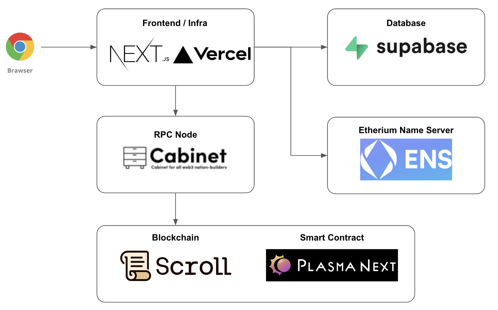

# ZKpaypay

[Demo Page](https://zkpaypay.vercel.app/)

[](https://www.youtube.com/watch?v=48rIRuYaeLU)

Deployment is done by updating the forked repository below and deploying to Vercel.

- [GitHub - sey323/zkpaypay-webapp: Repository for Vercel deployment](https://github.com/sey323/zkpaypay-webapp)

## Overview

Akindo description page is here

- [ZKpaypay | Akindo](https://app.akindo.io/communities/nPj6o40NdilJG4ZA/products/lrjxJG6wACnDw0Vo).

### System Architecture

The overall architecture is as follows. This repository corresponds to the Frontend in the diagram.



Contracts deployed on the Sepolia Scroll testnet are as follows.

| Contract Name | Address                                      | URL                                                                                             |
| ------------- | -------------------------------------------- | ----------------------------------------------------------------------------------------------- |
| Scroll JPY    | `0xba3e23dd4263ecfaf6e861a0a2c468c2ee2c3186` | [ScrollScan](https://sepolia.scrollscan.com/token/0xba3e23dd4263ecfaf6e861a0a2c468c2ee2c3186)   |
| ZKpaypay      | `0x5C848dcFf45257c7758dEdF1e975026b1dfE2db1` | [ScrollScan](https://sepolia.scrollscan.com/address/0x5C848dcFf45257c7758dEdF1e975026b1dfE2db1) |

For information about contracts, please refer to the following repository.

- [zkpaypay/zkpaypay-contracts · GitHub](https://github.com/zkpaypay/zkpaypay-contracts)

### Technologies Used

| Technology     | Use                                     | URL                                           |
| -------------- | --------------------------------------- | --------------------------------------------- |
| Scroll Seporia | Execution base of Plasma Next Contracts | [scroll.io](https://scroll.io/)               |
| Cabinet        | RPC Node for Scroll Seporia             | [cabinet-node.com](https://cabinet-node.com/) |
| ENS            | Name resolution of wallet addresses     | [ens.domains](https://ens.domains/)           |
| rainbowkit     | Wallet                                  | [rainbowkit.io](https://rainbowkit.io/)       |
| web3auth       | Wallet provider                         | [web3auth.io](https://web3auth.io/)           |

## Quick Start

Create `.env.local` and set the following environment variables.

```bash
# Seporia Scroll's RPC JSON API key issued at https://app.cabinet-node.com/
NEXT_PUBLIC_CABINET_SCROLL_SEPORIA_RPC_JSON_API_KEY=${JSON API Key}
# The Client Secret of the application registered at https://dashboard.web3auth.io/
NEXT_PUBLIC_WEB3AUTH_CLIENT_ID=${Client ID}

# Supabase settings
NEXT_PUBLIC_SUPABASE_URL=${Supabase URL}
NEXT_PUBLIC_SUPABASE_ANON_KEY=${Supabase Anon Key}
```

Launch the development environment with the following command.

```bash
npm run dev
```

## For Developers

### Fetching the schema from supabase

Run the following command and generate `database.types.ts`.

```bash
supabase gen types --lang=typescript --project-id xttxgubekhgwkbvseoxw --schema public > database.types.ts
```
